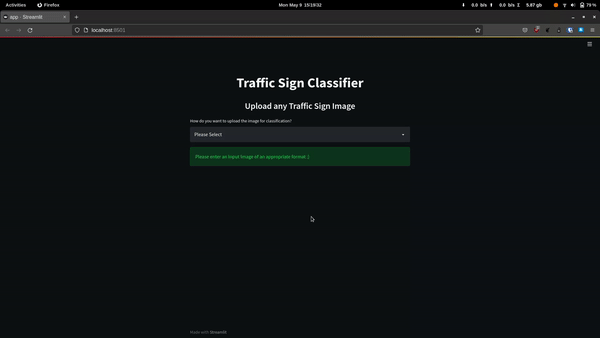

<h1 align='center'>Heavy Driver</h1>

## Description

Single-image and multi-image traffic sign classification

## Dataset Info

Dataset can be downloaded from <a href="https://www.kaggle.com/meowmeowmeowmeowmeow/gtsrb-german-traffic-sign">here</a>.

The German Traffic Sign Benchmark is a multi-class, single-image classification challenge held at the International Joint Conference on Neural Networks (IJCNN) 2011. We cordially invite researchers from relevant fields to participate: The competition is designed to allow for participation without special domain knowledge. Our benchmark has the following properties:

- Single-image, multi-class classification problem
- 43 classes
- More than 50,000 images in total
- Large, lifelike database

## How to use 

1. Clone the repository and change the directory

```bash
git clone git@github.com:archihalder/heavy-driver.git
cd heavy-driver
```

2. Create a virtual environment

```bash
pip install virtualenv
virtualenv heavy_driver_env
source heavy_driver_env/bin/activate
```

3. Install the required libraries

```bash
pip install -r requirements.txt
```

4. Run the streamlit app

```bash
streamlit run app.py
```

## Demonstration



## Contributors

- <a href="https://github.com/archihalder">Archi Halder</a>
- <a href="https://github.com/pushpeshkamal">Pushpesh Kamal</a>
